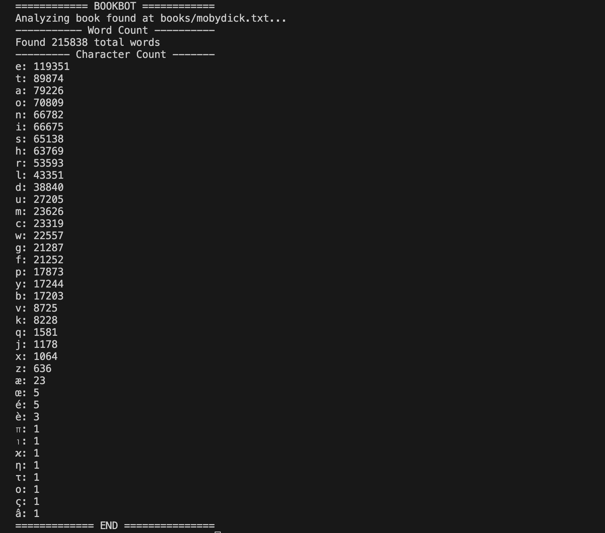

# bookbot

A project inspired by nerds like me who care about word count in books! 🤓

## Table of Contents

- [About](#about)
- [Demo](#demo)
- [Features](#features)
- [Technologies](#technologies)
- [Contributing](#contributing)

## About
BookBot is a lightweight Python tool designed to analyze large blocks of text—like book excerpts, transcripts, or essays—and return detailed word and letter statistics.
With a simple interface, BookBot provides:
  -Total word count
  -Frequency of each unique word
  -Letter count for every word

## Demo
In this screenshot, I have uploaded the book Moby Dick transcript as a .txt file, authored by the great and powerful Herman Melville.
When python3 main.py <path_to_book> is entered here is the result:

## Features
Abilites to count letters and words in a document
***Front end UI coming soon.

## Technologies
Python

## Contributing
Me, Myself, & I 👋 
